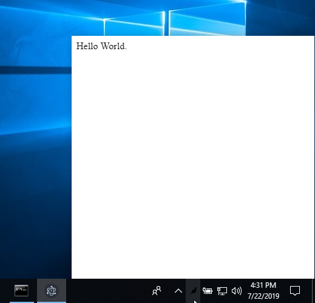

[](https://travis-ci.org/maxogden/menubar)
[](https://www.npmjs.com/package/menubar)
[](https://david-dm.org/maxogden/menubar)


<br /><br /><br />

<h1 align="center">➖ Menubar</h1>
<h4 align="center">High level way to create menubar desktop applications with Electron.</h4>

<br /><br /><br />

This module provides boilerplate for setting up a menubar application using Electron. All you have to do is point it at your `index.html` and `menubar` will handle the rest.

✅ Only one dependency, and one peer-dependency.

✅ Works on macOS, Windows and most Linuxes. See [details](./WORKING_PLATFORMS.md).

✅ 💥 [**3.6kB minified + gzipped**](https://bundlephobia.com/result?p=menubar) 💥

|  |  |  |
| :-----------------------------------------------------------: | :--------------------------------------------------------: | :------------------------------------------------------: |
|                      macOS Mojave 10.14                       |                         Windows 10                         |                       Ubuntu 18.04                       |

## Installation

```bash
yarn add menubar
```

## Usage

Starting with your own new project, run these commands:

```bash
$ yarn add menubar
$ touch myApp.js
$ touch index.html
```

Fill `index.html` with some HTML, and `myApp.js` like this:

```javascript
const { menubar } = require('menubar');

const mb = menubar();

mb.on('ready', () => {
  console.log('app is ready');
  // your app code here
});
```

Then use `electron` to run the app:

```bash
$ electron myApp.js
```

Alternatively, see [`examples/hello-world`](/examples/hello-world) folder for a simple working example.

## `Menubar` Class

The return value of `menubar()` is a `Menubar` class instance, which has these properties:

- `app`: the [Electron App](https://electronjs.org/docs/api/app) instance,
- `window`: the [Electron Browser Window](https://electronjs.org/docs/api/browser-window) instance,
- `tray`: the [Electron Tray](https://electronjs.org/docs/api/tray) instance,
- `positioner`: the [Electron Positioner](https://github.com/jenslind/electron-positioner) instance,
- `setOption(option, value)`: change an option after menubar is created,
- `getOption(option)`: get an menubar option,
- `showWindow()`: show the menubar window,
- `hideWindow()`: hide the menubar window

See the reference [API docs](./docs/classes/_menubar_.menubar.md).

## `menubar()` Options

You can pass an optional options object into the `menubar({ ... })` function:

- `dir` (default `process.cwd()`) - the app source directory
- `index` (default `file:// + opts.dir + index.html`) - The URL to load the menubar's browserWindow with. The url can be a remote address (e.g. `http://`) or a path to a local HTML file using the `file://` protocol.
- `browserWindow` - BrowserWindow options to be passed to the BrowserWindow constructor, see [Electron docs](https://electronjs.org/docs/api/browser-window#new-browserwindowoptions). Some interesting fields to passed down are:
  - `x` (default `undefined`) - the x position of the window
  - `y` (default `undefined`) - the y position of the window
  - `width` (default 400) - window width
  - `height` (default 400) - window height
  - `alwaysOnTop` (default false) - if true, the window will not hide on blur
- `icon` (default `opts.dir + IconTemplate.png`) - the png icon to use for the menubar. A good size to start with is 20x20. To support retina, supply a 2x sized image (e.g. 40x40) with `@2x` added to the end of the name, so `icon.png` and `icon@2x.png` and Electron will automatically use your `@2x` version on retina screens.
- `tooltip` (default empty) - menubar tray icon tooltip text
- `tray` (default created on-the-fly) - an electron `Tray` instance. if provided `opts.icon` will be ignored
- `preloadWindow` (default false) - Create [BrowserWindow](https://electronjs.org/docs/api/browser-window#new-browserwindowoptions) instance before it is used -- increasing resource usage, but making the click on the menubar load faster.
- `loadUrlOptions` - (default undefined) The options passed when loading the index URL in the menubar's browserWindow. Everything browserWindow.loadURL supports is supported; this object is simply passed onto [browserWindow.loadURL](https://electronjs.org/docs/api/browser-window#winloadurlurl-options)
- `showOnAllWorkspaces` (default true) - Makes the window available on all OS X workspaces.
- `windowPosition` (default trayCenter and trayBottomCenter on Windows) - Sets the window position (x and y will still override this), check [positioner docs](https://github.com/jenslind/electron-positioner#docs) for valid values.
- `showDockIcon` (default false) - Configure the visibility of the application dock icon.
- `showOnRightClick` (default false) - Show the window on 'right-click' event instead of regular 'click'

See the reference [API docs](./docs/interfaces/_types_.options.md).

## Events

The `Menubar` class is an event emitter:

- `ready` - when `menubar`'s tray icon has been created and initialized, i.e. when `menubar` is ready to be used. Note: this is different than Electron app's `ready` event, which happens much earlier in the process
- `create-window` - the line before `new BrowserWindow()` is called
- `before-load` - after create window, before loadUrl (can be used for `require("@electron/remote/main").enable(webContents)`)
- `after-create-window` - the line after all window init code is done and url was loaded
- `show` - the line before `window.show()` is called
- `after-show` - the line after `window.show()` is called
- `hide` - the line before `window.hide()` is called (on window blur)
- `after-hide` - the line after `window.hide()` is called
- `after-close` - after the `.window` (BrowserWindow) property has been deleted
- `focus-lost` - emitted if always-on-top option is set and the user clicks away

## Compatibility with Electron

| menubar  | Electron                   | Notes                                                                                                                      |
| -------- | -------------------------- | -------------------------------------------------------------------------------------------------------------------------- |
| 9.x.x    | 9.x.x \| 10.x.x \| 11.x.x \| 12.x.x \| 13.x.x \| 14.x.x \| 15.x.x \| 16.x.x \| 17.x.x \| 18.x.x \| 19.x. \| 20.x. \| 21.x.x \| 22.x.x                   |                                                                                                                            |
| 8.x.x    | 8.x.x                      |                                                                                                                            |
| 7.x.x    | 7.x.x                      |                                                                                                                            |
| 6.x.x    | 4.x.x \| 5.x.x \| 6.x.x    | Not recommended for [security reasons](https://electronjs.org/docs/tutorial/security#17-use-a-current-version-of-electron) |
| <= 5.x.x | <= 3.x.x                   | Please, _please_ don't use these old versions                                                                              |

## API Docs

See the reference [API docs](./docs/globals.md).

## Tips

- Use `mb.on('after-create-window', callback)` to run things after your app has loaded. For example you could run `mb.window.openDevTools()` to open the developer tools for debugging, or load a different URL with `mb.window.loadURL()`
- Use `mb.on('focus-lost')` if you would like to perform some operation when using the option `browserWindow.alwaysOnTop: true`
- To restore focus of previous window after menubar hide, use `mb.on('after-hide', () => { mb.app.hide() } )` or similar
- To create a native menu, you can use `tray.setContextMenu(contextMenu)`, and pass this custom tray to menubar: `const mb = menubar({ tray });`. See [this example](https://github.com/maxogden/menubar/tree/master/examples/native-menu) for more information.
- To avoid a flash when opening your menubar app, you can disable backgrounding the app using the following: `mb.app.commandLine.appendSwitch('disable-backgrounding-occluded-windows', 'true');`
