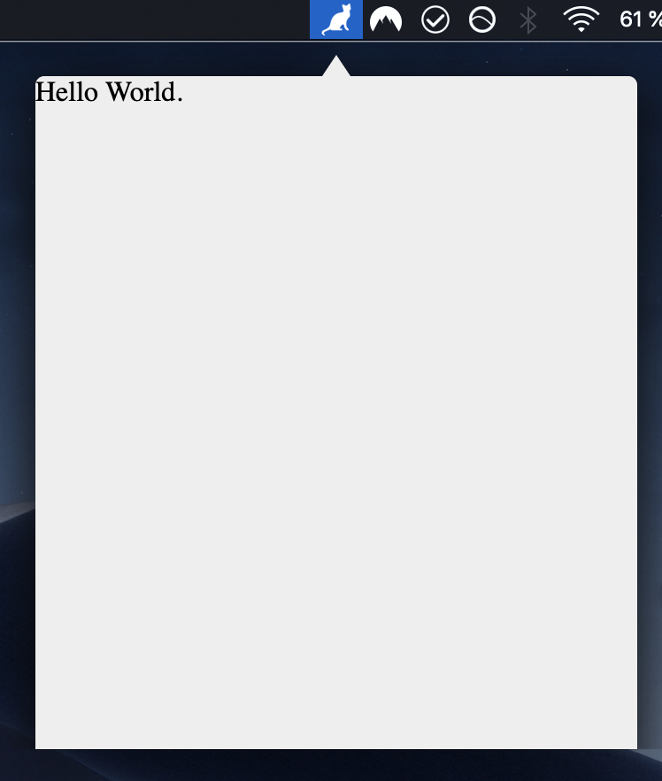

# example-menubar-arrow

## Description

A menubar app with an arrow on top, that gives the app a popover look.

Thanks @leilarrossi for this example, see https://github.com/maxogden/menubar/issues/78.

## Screenshot

## Instructions

- Clone the repository.
- Run `yarn install` from the root folder.
- Run `yarn build` from the root folder.
- `cd` into this directory.
- Run `yarn install` to install this example's dependencies.
- Run `yarn start` from this directory to run app.
