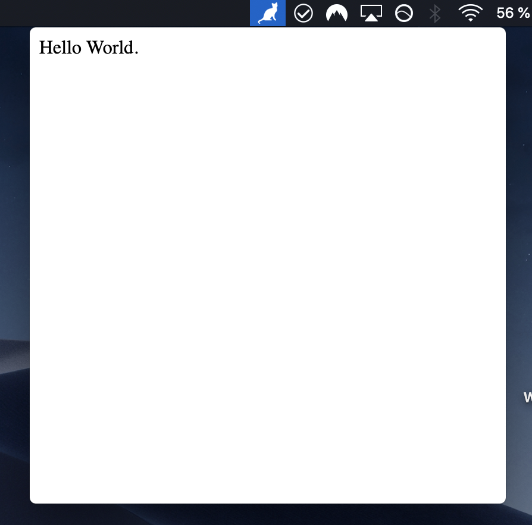

# example-menubar-hello-world

## Description

This is a simple Hello World menubar app that will just open a window that says "Hello World".

## Screenshot

## Instructions

- Clone the repository.
- Run `yarn install` from the root folder.
- Run `yarn build` from the root folder.
- `cd` into this directory.
- Run `yarn install` to install this example's dependencies.
- Run `yarn start` from this directory to run app.
