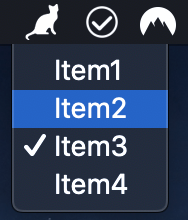

# example-menubar-native-menu

## Description

This will create a menubar app with a native menu.

Courtesy of @tslater in https://github.com/maxogden/menubar/issues/178.

## Screenshot

## Instructions

- Clone the repository.
- Run `yarn install` from the root folder.
- Run `yarn build` from the root folder.
- `cd` into this directory.
- Run `yarn install` to install this example's dependencies.
- Run `yarn start` from this directory to run app.
