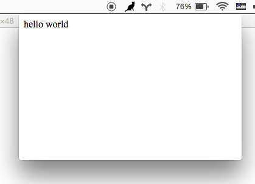

# menubar

High level way to create menubar desktop applications with electron

This module provides boilerplate for setting up a menubar application using electron. all you have to do is point it at your `index.html` and menubar icon and this will handle opening/closing a window when you click/blur.

Works on Mac OS, Windows and some Linuxes (Tested on Xfce4, your mileage may vary -- patches welcome!)

**Mac OS**



**Windows**


[](https://travis-ci.org/maxogden/menubar)

[](https://github.com/feross/standard)

Watch the 1HR screen recording of me coding this module: https://www.youtube.com/watch?v=PAJAvsyaHs0

This module was written for + is used by [Monu](https://github.com/maxogden/monu)

## installation

```
npm install menubar --save
```

## usage

create a JS program like this:

```js
var menubar = require('menubar')

var mb = menubar()

mb.on('ready', function ready () {
  console.log('app is ready')
  // your app code here
})
```

make sure there is also a `index.html` file in `dir`

then use [`electron`](https://npmjs.org/electron-prebuilt) or [`electron-packager`](https://npmjs.org/electron-packager) to build/run the app:

```
$ npm install electron-prebuilt -g
$ electron your-app.js
```

see `example/` for a working example

the return value of `mb` is an event emitter with these properties:

```
{
  app: the electron require('app') instance,
  window: the electron require('browser-window') instance,
  tray: the electron require('tray') instance,
  positioner: the electron-positioner instance,
  setOption(option, value): change an option after menubar is created,
  getOption(option): get an menubar option,
  showWindow(): show the menubar window,
  hideWindow(): hide the menubar window
}
```

## options

you can pass an optional options object into the menubar constructor

- `dir` (default `process.cwd()`) - the app source directory
- `index` (default `file:// + opts.dir + index.html`) - the html to load for the pop up window
- `icon` (default `opts.dir + IconTemplate.png`) - the png icon to use for the menubar. A good size to start with is 20x20. To support retina, supply a 2x sized image (e.g. 40x40) with `@2x` added to the end of the name, so `icon.png` and `icon@2x.png` and Electron will automatically use your `@2x` version on retina screens.
- `tooltip` (default empty) - menubar tray icon tooltip text
- `tray` (default created on-the-fly) - an electron `Tray` instance. if provided `opts.icon` will be ignored
- `preloadWindow` (default false) - Create [BrowserWindow](https://github.com/atom/electron/blob/master/docs/api/browser-window.md) instance before it is used -- increasing resource usage, but making the click on the menubar load faster.
- `width` (default 400) - window width
- `height` (default 400) - window height
- `x` (default null) - the x position of the window
- `y` (default null) - the y position of the window
- `alwaysOnTop` (default false) - if true, the window will not hide on blur
- `showOnAllWorkspaces` (default true) - Makes the window available on all OS X workspaces.
- `windowPosition` (default trayCenter and trayBottomCenter on Windows) - Sets the window position (x and y will still override this), check [positioner docs](https://github.com/jenslind/electron-positioner#docs) for valid values.
- `showDockIcon` (default false) - Configure the visibility of the application dock icon.
- `showOnRightClick` (default false) - Show the window on 'right-click' event instead of regular 'click'

## events

the return value of the menubar constructor is an event emitter

- `ready` - when the app has been created and initialized
- `create-window` - the line before new BrowserWindow is called
- `after-create-window` - the line after all window init code is done
- `show` - the line before window.show is called
- `after-show` - the line after window.show is called
- `hide` - the line before window.hide is called (on window blur)
- `after-hide` - the line after window.hide is called
- `after-close` - after the .window (BrowserWindow) property has been deleted
- `focus-lost` - emitted if always-on-top option is set and the user clicks away

## tips

- Use `mb.on('after-create-window', callback)` to run things after your app has loaded. For example you could run `mb.window.openDevTools()` to open the developer tools for debugging, or load a different URL with `mb.window.loadUrl()`

- Use `mb.on('focus-lost')` if you would like to perform some operation when using the option `alwaysOnTop:true`

- To restore focus of previous window after menubar hide, use `mb.on('after-hide', () => { mb.app.hide() } )` or similar